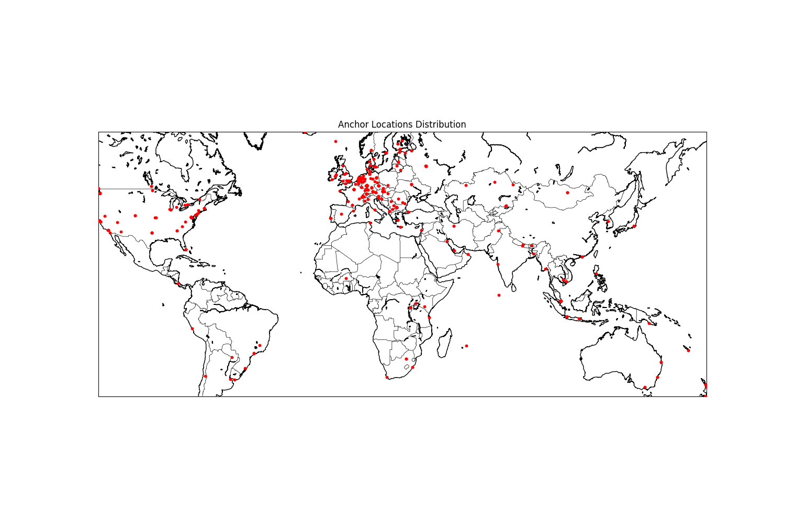
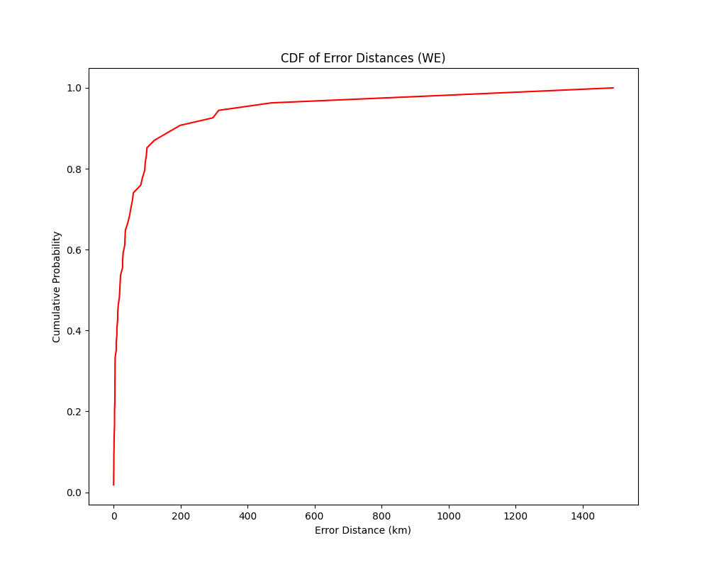
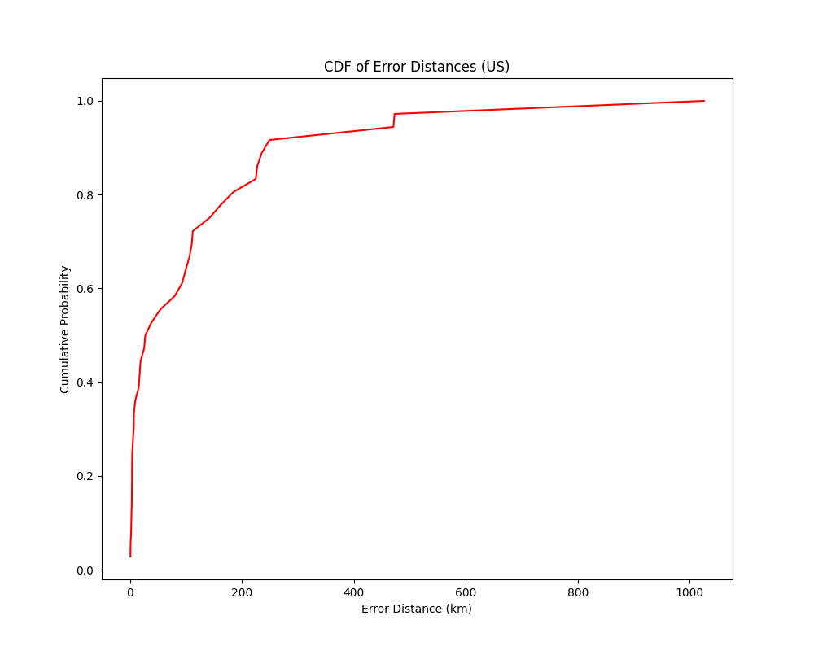
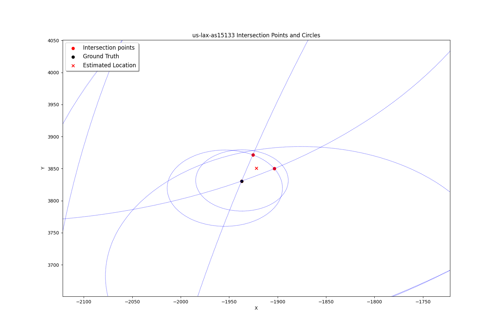

# Constraint-Based Geolocation of Internet Hosts - My Replication

## Description

In this project, I utilized modern data from 2018, sourced from the [repository](https://github.com/menonsamir/CBG-replication.git). I followed the overall approach outlined in their Python 2 code. However, I decided to shake things up a bit by implementing a different projection method: instead of the Mercator projection, I opted for the AEA (Albers Equal Area) projection. I think it's a more accurate representation of the Earth's surface. 

## Data

<div align="middle">

</div>

## Results

### CDF of Error Distances for Two Regions

**In Western Europe:**

<div align="middle">

</div>

- Mean error distance: 96.89 km 
- Median error distance: 19.08 km

**In the United States:**

<div align="middle">

</div>

- Mean error distance: 117.72 km 
- Median error distance: 32.77 km

For more details, feel free to check out the [results](results) folder!

## Example

<div align="middle">

</div>

## Usage
1. First, clone the repository:

   ```bash
   git clone https://github.com/SurvivorNo1/InternetHostGeo.git
   ```

2. Next, install the required packages:

   ```bash
   pip install -r requirements.txt
   ```

3. All of the code is contained within a Jupyter Notebook. To run the code and see the results, simply open the notebook and click "Run All."

## Acknowledgments

Thanks to [menonsamir](https://github.com/menonsamir/CBG-replication.git) for their fantastic code and invaluable insights. Your work made this project possible!

## References

For more information on the original methodology, check out the paper: [Constraint-Based Geolocation of Internet Hosts](https://dl.acm.org/doi/10.1109/TNET.2006.886332).
